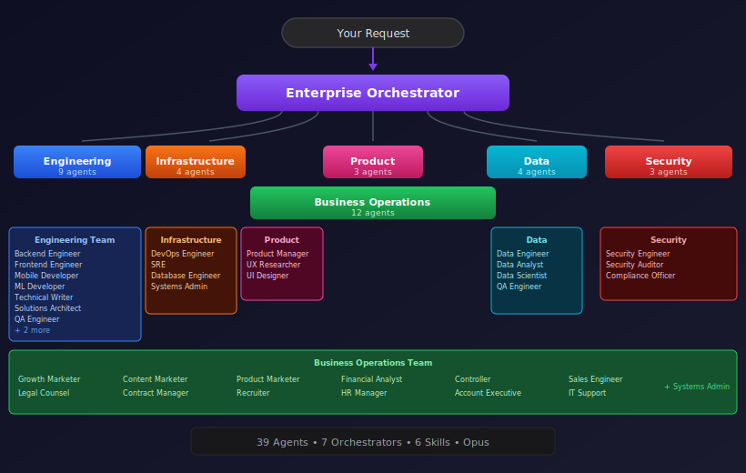

<p align="center">
  
  
  
  
</p>

<h1 align="center">Enterprise Team</h1>

<p align="center">
  <strong>Hire a whole company with one plugin.</strong><br/>
  39 specialized AI agents across Engineering, Product, Infrastructure, Data, Security, and Business.
</p>

---

## The Problem

You have Claude Code. You have skills. But when you say "build me a feature," who decides whether that's a frontend task, backend task, or both? When you say "deploy this," who knows if you need DevOps, database work, or infrastructure setup?

**Skills are powerful but siloed.** You end up calling them manually or hoping the right one triggers.

## The Solution

**Enterprise Team** gives you a virtual company with department orchestrators that route work to the right specialists automatically.

```
"Build a REST API for user auth"
     │
     ▼
┌─────────────────────────────────────────────────────────┐
│              enterprise-orchestrator                     │
│         "This is engineering work..."                   │
└─────────────────────┬───────────────────────────────────┘
                      ▼
┌─────────────────────────────────────────────────────────┐
│              engineering-orchestrator                    │
│     "API work → routing to backend-engineer"            │
└─────────────────────┬───────────────────────────────────┘
                      ▼
┌─────────────────────────────────────────────────────────┐
│                  backend-engineer                        │
│     Creates the API with auth, validation, tests        │
└─────────────────────────────────────────────────────────┘
```

---

## How It Works

<p align="center">
  
</p>

### Two-Layer Routing

1. **Enterprise Orchestrator** - Identifies the department (Engineering? Product? Business?)
2. **Department Orchestrator** - Routes to the exact specialist needed

All orchestrators and specialists use **Opus** for maximum capability.

---

## Quick Start

```bash
# Install with npx
npx skills add Chipagosfinest/enterprise-team --yes

# Or clone directly
git clone https://github.com/Chipagosfinest/enterprise-team.git ~/.claude/plugins/enterprise-team
```

Then just ask for what you need:

```
"Design and build a settings page with dark mode"
"Set up CI/CD with GitHub Actions"
"Create a financial model for our Q2 projections"
"Review this code for security vulnerabilities"
```

---

## Departments & Specialists

### Engineering (9 specialists)
| Specialist | Expertise |
|------------|-----------|
| `backend-engineer` | APIs, Node.js, Python, PostgreSQL, REST, GraphQL |
| `frontend-engineer` | React, Vue, TypeScript, CSS, accessibility |
| `mobile-developer` | iOS, Android, React Native, Flutter |
| `ml-developer` | PyTorch, TensorFlow, ML pipelines |
| `technical-writer` | Documentation, API docs, tutorials |
| `solutions-architect` | System design, architecture decisions |
| `qa-engineer` | Testing, test automation, quality assurance |

### Infrastructure (4 specialists)
| Specialist | Expertise |
|------------|-----------|
| `devops-engineer` | Docker, Kubernetes, Terraform, CI/CD |
| `sre` | Monitoring, incidents, SLOs, reliability |
| `database-engineer` | PostgreSQL, Supabase, migrations |
| `systems-admin` | Linux, Windows Server, cloud admin |

### Product (3 specialists)
| Specialist | Expertise |
|------------|-----------|
| `product-manager` | Roadmaps, prioritization, PRDs |
| `ux-researcher` | User interviews, personas, testing |
| `ui-designer` | Visual design, design systems |

### Data (4 specialists)
| Specialist | Expertise |
|------------|-----------|
| `data-engineer` | ETL, pipelines, data warehouses |
| `data-analyst` | SQL, dashboards, business intelligence |
| `data-scientist` | ML models, statistical analysis, experiments |

### Security (3 specialists)
| Specialist | Expertise |
|------------|-----------|
| `security-engineer` | Secure coding, vulnerability fixes |
| `security-auditor` | Penetration testing, risk assessment |
| `compliance-officer` | SOC2, GDPR, regulatory compliance |

### Business Operations (9 specialists)
| Specialist | Expertise |
|------------|-----------|
| `growth-marketer` | Acquisition, conversion, analytics |
| `content-marketer` | Blog posts, SEO, content strategy |
| `product-marketer` | Positioning, launches, competitive analysis |
| `financial-analyst` | Modeling, forecasting, unit economics |
| `controller` | Accounting, financial reporting, controls |
| `legal-counsel` | Contracts, compliance, IP |
| `contract-manager` | CLM, negotiations, vendor management |
| `recruiter` | Hiring, sourcing, candidate experience |
| `hr-manager` | HR operations, policies, employee relations |
| `account-executive` | Sales cycles, negotiations, closing |
| `sales-engineer` | Technical sales, demos, POCs |
| `it-support` | Helpdesk, systems, endpoint security |

---

## Why This Approach?

| Approach | Pros | Cons |
|----------|------|------|
| **Individual Skills** | Focused, lightweight | Manual invocation required |
| **Single Agent** | Simple | Jack of all trades, master of none |
| **Enterprise Team** | Right specialist for every task | Slightly more setup |

The orchestrator pattern means you get **expert-level responses** without needing to know which expert to call.

---

## License

MIT © [Alec Gutman](https://github.com/Chipagosfinest)
