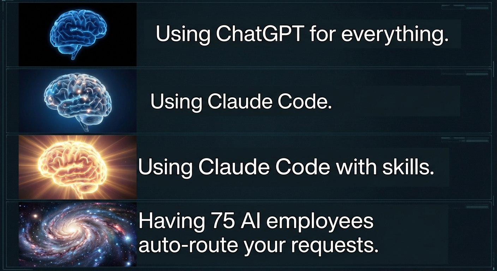
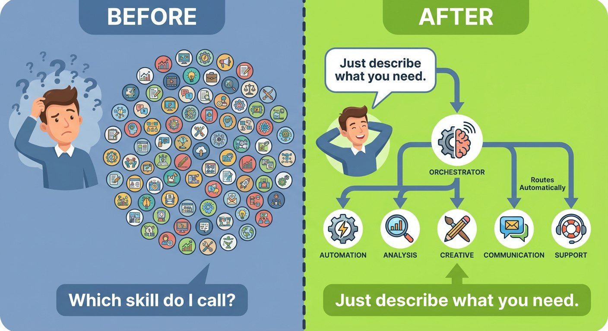

<p align="center">
  
  
  
  
</p>

<h1 align="center">Enterprise Team</h1>

<p align="center">
  <strong>Hire a whole company with one plugin.</strong><br/>
  75 specialized AI agents across Engineering, Product, Infrastructure, Data, Security, Marketing, Sales, Finance, Legal, and People.
</p>

<p align="center">
  
</p>

---

## The Problem with Generalist Agents

When you ask Claude Code to "build me a dashboard," it does its best. But Claude is trying to be everything at once: frontend developer, backend engineer, database architect, and UI designer. The result? Competent but generic work.

The real issue is **context switching at scale**. A generalist agent:

- Has to hold patterns for dozens of domains simultaneously
- Can't go deep on any single specialty
- Applies the same approach whether the task needs a security mindset or a marketing mindset
- Doesn't know when to ask for help from a different discipline

You end up with code that works but doesn't reflect what a dedicated specialist would produce. The API design a backend-focused engineer would craft. The component architecture a frontend specialist would build. The security hardening an AppSec engineer would insist on.

**Skills help, but they're manual.** You have to know which skill to invoke, when to switch contexts, and how to coordinate handoffs between different specialties. That cognitive load is on you.

## A Different Approach

What if Claude Code could operate like an actual company?

The key insight: **departments exist for a reason**. Real organizations don't have one person doing everything. They have specialists who go deep, orchestrated by managers who route work to the right people.

Enterprise Team replicates this structure:

1. **Department Orchestrators** understand what their specialists do and route work accordingly
2. **Specialists** go deep on their domain with focused system prompts, tools, and patterns
3. **Cross-functional routing** means a single request can flow through multiple departments seamlessly

When you say "build me a settings page with dark mode," Enterprise Team doesn't just write code. The orchestrator recognizes this needs:
- **Frontend Engineer** for component architecture
- **UI Designer** for the visual system
- **Backend Engineer** if settings need persistence
- **Security Engineer** if settings include sensitive data

Each specialist contributes their expertise. The result is closer to what a real team would produce.

<p align="center">
  
</p>

---

## How It Works

### Phase 1: Request Analysis

When you make a request, the orchestration layer analyzes it:

```
User: "Set up authentication with OAuth and add a login page"
```

The orchestrator identifies:
- **Primary domain**: Engineering (auth system + UI)
- **Specialists needed**: Backend Engineer (OAuth flow), Frontend Engineer (login page), Security Engineer (token handling)
- **Sequence**: Security review of approach → Backend implementation → Frontend integration

### Phase 2: Specialist Dispatch

Each specialist receives:
- The original request with relevant context
- Their domain-specific system prompt (security mindset, performance focus, etc.)
- Access to tools appropriate for their role
- Awareness of what other specialists are handling

The **Backend Engineer** focuses on:
- OAuth provider integration
- Token refresh logic
- Session management
- API endpoint design

The **Frontend Engineer** focuses on:
- Login form UX
- Error state handling
- Loading states
- Redirect flows

The **Security Engineer** reviews:
- Token storage (not localStorage!)
- CSRF protection
- Rate limiting needs
- Secure cookie configuration

### Phase 3: Integration

Work products from specialists are integrated with awareness of each other. The frontend engineer knows what endpoints the backend engineer created. The security engineer's requirements are applied to both.

### When Departments Hand Off

Cross-functional work is common:

| Request | Flow |
|---------|------|
| "Create a pricing page" | Product Manager (positioning) → UI Designer (layout) → Frontend Engineer (implementation) → Growth Marketer (conversion optimization) |
| "We need SOC2 compliance" | Compliance Officer (requirements) → Security Engineer (implementation) → Technical Writer (documentation) |
| "Launch the new feature" | Product Manager (GTM plan) → Marketing (campaign) → Engineering (feature flags) → Support (training) |

---

## Example Session

```
User: Build a user settings page where users can update their profile,
      change their password, and manage notification preferences.

Orchestrator: This request spans multiple specialties. Routing to:
  - UI Designer: Settings page layout and component design
  - Frontend Engineer: Implementation and state management
  - Backend Engineer: API endpoints for settings CRUD
  - Security Engineer: Password change flow review

[UI Designer]
Designing settings page structure:
- Tab-based navigation (Profile | Security | Notifications)
- Form sections with clear hierarchy
- Inline validation feedback
- Responsive layout for mobile

[Frontend Engineer]
Implementing settings components:
- useSettings hook for state management
- Form validation with react-hook-form
- Optimistic updates with rollback
- Tab routing with URL sync

[Backend Engineer]
Creating settings API:
- GET/PATCH /api/settings/profile
- POST /api/settings/password (requires current password)
- GET/PATCH /api/settings/notifications
- Rate limiting on password endpoint

[Security Engineer]
Security review:
✓ Password change requires current password verification
✓ Password strength requirements enforced
✓ Session invalidation option after password change
⚠ Recommend: Add email notification on password change
⚠ Recommend: Add 2FA prompt for security settings

Orchestrator: Implementation complete. Security recommendations
flagged for your review.
```

---

## Quick Start

Open your terminal and run:

```bash
rm -rf ~/.claude/plugins/enterprise-team && git clone https://github.com/Chipagosfinest/enterprise-team.git ~/.claude/plugins/enterprise-team
```

That's it. Start Claude Code and the plugin is ready. Then just ask for what you need:

```
"Design and build a settings page with dark mode"
"Set up CI/CD with GitHub Actions"
"Create a financial model for our Q2 projections"
"Review this code for security vulnerabilities"
"Plan our product launch campaign"
```

The orchestrator routes to the right specialists automatically.

---

## Departments & Specialists

### Engineering (10 specialists)
| Specialist | Expertise |
|------------|-----------|
| `backend-engineer` | APIs, Node.js, Python, PostgreSQL, REST, GraphQL |
| `frontend-engineer` | React, Vue, TypeScript, CSS, accessibility |
| `fullstack-engineer` | End-to-end development across all layers |
| `mobile-developer` | iOS, Android, React Native, Flutter |
| `embedded-engineer` | Firmware, IoT, C/C++, microcontrollers |
| `blockchain-engineer` | Smart contracts, Solidity, Web3, DeFi |
| `ml-developer` | PyTorch, TensorFlow, ML pipelines |
| `solutions-architect` | System design, architecture decisions |
| `qa-engineer` | Testing, test automation, quality assurance |
| `technical-writer` | Documentation, API docs, tutorials |

### Infrastructure (4 specialists)
| Specialist | Expertise |
|------------|-----------|
| `devops-engineer` | Docker, Kubernetes, Terraform, CI/CD |
| `sre` | Monitoring, incidents, SLOs, reliability |
| `database-engineer` | PostgreSQL, Supabase, migrations |
| `systems-admin` | Linux, Windows Server, cloud admin |

### Product (5 specialists)
| Specialist | Expertise |
|------------|-----------|
| `product-manager` | Roadmaps, prioritization, PRDs |
| `ux-researcher` | User interviews, personas, testing |
| `ui-designer` | Visual design, design systems |
| `design-strategist` | Design systems, experience strategy |
| `instructional-designer` | Learning design, course development |

### Data (3 specialists)
| Specialist | Expertise |
|------------|-----------|
| `data-engineer` | ETL, pipelines, data warehouses |
| `data-analyst` | SQL, dashboards, business intelligence |
| `data-scientist` | ML models, statistical analysis, experiments |

### Security (3 specialists)
| Specialist | Expertise |
|------------|-----------|
| `security-engineer` | Secure coding, vulnerability fixes |
| `security-auditor` | Penetration testing, risk assessment |
| `compliance-officer` | SOC2, GDPR, regulatory compliance |

### Marketing (14 specialists)
| Specialist | Expertise |
|------------|-----------|
| `growth-marketer` | Acquisition, conversion, paid ads |
| `content-marketer` | Blog posts, SEO content, content strategy |
| `product-marketer` | Positioning, launches, competitive analysis |
| `brand-marketer` | Brand strategy, identity, guidelines |
| `social-media-manager` | Social content, community, engagement |
| `seo-specialist` | Search optimization, keywords, technical SEO |
| `email-marketer` | Email campaigns, automation, newsletters |
| `pr-specialist` | Media relations, press releases |
| `communications-specialist` | Internal/external comms, messaging |
| `community-manager` | Community building, forums, advocacy |
| `events-manager` | Conferences, webinars, trade shows |
| `video-producer` | Video content, production, editing |
| `graphic-designer` | Visual design, collateral, graphics |
| `web-designer` | Website design, landing pages |

### Sales (5 specialists)
| Specialist | Expertise |
|------------|-----------|
| `account-executive` | Sales cycles, negotiations, closing |
| `sales-engineer` | Technical sales, demos, POCs |
| `business-developer` | New markets, lead gen, opportunities |
| `partnerships-manager` | Strategic partnerships, alliances |
| `customer-success-manager` | Onboarding, retention, expansion |

### Finance (4 specialists)
| Specialist | Expertise |
|------------|-----------|
| `financial-analyst` | Modeling, forecasting, unit economics |
| `accountant` | General ledger, reconciliations, close |
| `controller` | Financial reporting, compliance |
| `corporate-development` | M&A, strategic investments |

### Legal (4 specialists)
| Specialist | Expertise |
|------------|-----------|
| `legal-counsel` | Contracts, compliance, IP |
| `compliance-officer` | Regulatory, SOC2, GDPR |
| `contract-manager` | CLM, negotiations, vendor management |
| `paralegal` | Document prep, research, support |

### People (6 specialists)
| Specialist | Expertise |
|------------|-----------|
| `recruiter` | Hiring, sourcing, candidate experience |
| `hr-manager` | HR operations, policies, employee relations |
| `compensation-analyst` | Salary, equity, benefits benchmarking |
| `talent-development` | Learning, performance, career growth |
| `hris-analyst` | HR systems, people analytics |
| `payroll-specialist` | Payroll processing, tax compliance |

### Support (4 specialists)
| Specialist | Expertise |
|------------|-----------|
| `it-support` | Helpdesk, systems, endpoint security |
| `support-engineer` | Technical support, issue diagnosis |
| `developer-relations` | Developer community, SDKs, docs |
| `technical-trainer` | Training programs, workshops |

### Consulting (2 specialists)
| Specialist | Expertise |
|------------|-----------|
| `technical-consultant` | Client solutions, implementations |
| `technical-business-analyst` | Requirements, process mapping |

### Program Management (1 specialist)
| Specialist | Expertise |
|------------|-----------|
| `technical-program-manager` | Agile, sprint planning, delivery |

---

## Why This Approach?

| Approach | How It Works | Best For |
|----------|--------------|----------|
| **Single Agent** | One generalist handles everything | Quick tasks, exploration |
| **Individual Skills** | Manual invocation of focused skills | When you know exactly what you need |
| **Swarms/Parallel** | Dependency-based parallel execution | Large projects with clear task breakdown |
| **Enterprise Team** | Automatic routing to domain specialists | Cross-functional work, expert-level output |

Enterprise Team shines when:
- You don't know which specialty a task needs
- Work crosses multiple domains (most real work does)
- You want specialist-quality output without manual orchestration
- The request is ambiguous and benefits from multiple perspectives

The tradeoff: More comprehensive responses, slightly more tokens. If you know exactly what you need and just want a quick answer, a single skill or direct prompt might be faster.

---

## License

MIT © [Alec Gutman](https://github.com/Chipagosfinest)
