<p align="center">
  
  
  
</p>

<h1 align="center">🏢 Enterprise Team</h1>

<p align="center">
  <strong>Hire a whole company with one plugin.</strong><br/>
  50+ specialized AI agents across Engineering, Product, Infrastructure, Data, Security, and Business.
</p>

---

## The Problem

You have Claude Code. You have skills. But when you say "build me a feature," who decides whether that's a frontend task, backend task, or both? When you say "deploy this," who knows if you need DevOps, database work, or infrastructure setup?

**Skills are powerful but siloed.** You end up calling them manually or hoping the right one triggers.

## The Solution

**Enterprise Team** gives you a virtual company with department orchestrators that route work to the right specialists automatically.

```
"Build a REST API for user auth"
     │
     ▼
┌─────────────────────────────────────────────────────────┐
│              enterprise-orchestrator                     │
│         "This is engineering work..."                   │
└─────────────────────┬───────────────────────────────────┘
                      ▼
┌─────────────────────────────────────────────────────────┐
│              engineering-orchestrator                    │
│     "API work → routing to backend-engineer"            │
└─────────────────────┬───────────────────────────────────┘
                      ▼
┌─────────────────────────────────────────────────────────┐
│                  backend-engineer                        │
│     Creates the API with auth, validation, tests        │
└─────────────────────────────────────────────────────────┘
```

---

## How It Works

```mermaid
flowchart TD
    User[Your Request] --> EO[Enterprise Orchestrator]

    EO --> ENG[Engineering]
    EO --> INFRA[Infrastructure]
    EO --> PROD[Product]
    EO --> DATA[Data]
    EO --> SEC[Security]
    EO --> BIZ[Business]

    ENG --> BE[Backend Engineer]
    ENG --> FE[Frontend Engineer]
    ENG --> Mobile[Mobile Developer]
    ENG --> ML[ML Developer]
    ENG --> BC[Blockchain Engineer]

    INFRA --> DevOps[DevOps Engineer]
    INFRA --> SRE[SRE]
    INFRA --> DB[Database Engineer]

    PROD --> PM[Product Manager]
    PROD --> UX[UX Researcher]
    PROD --> UI[UI Designer]

    DATA --> DE[Data Engineer]
    DATA --> QA[QA Engineer]
    DATA --> Analytics[Analytics]

    SEC --> SecEng[Security Engineer]
    SEC --> Audit[Security Auditor]

    BIZ --> Sales[Sales]
    BIZ --> Marketing[Marketing]
    BIZ --> Finance[Finance]
    BIZ --> Legal[Legal]
    BIZ --> HR[HR]
```



### Two-Layer Routing

1. **Enterprise Orchestrator** - Identifies the department (Engineering? Product? Business?)
2. **Department Orchestrator** - Routes to the exact specialist needed

All orchestrators use **Opus** for intelligent routing decisions.

---

## Quick Start

```bash
# Install with npx
npx skills add Chipagosfinest/enterprise-team --yes

# Or clone directly
git clone https://github.com/Chipagosfinest/enterprise-team.git ~/.claude/plugins/enterprise-team
```

Then just ask for what you need:

```
"Design and build a settings page with dark mode"
"Set up CI/CD with GitHub Actions"
"Create a financial model for our Q2 projections"
"Review this code for security vulnerabilities"
```

---

## Departments & Specialists

### 🛠 Engineering
| Specialist | Expertise |
|------------|-----------|
| `backend-engineer` | APIs, Node.js, Python, databases |
| `frontend-engineer` | React, Vue, CSS, UI components |
| `fullstack-engineer` | End-to-end feature development |
| `mobile-developer` | iOS, Android, React Native, Flutter |
| `embedded-engineer` | Firmware, IoT, C/C++ |
| `blockchain-engineer` | Smart contracts, Solidity, Web3 |
| `ml-developer` | PyTorch, TensorFlow, ML pipelines |
| `technical-architect` | System design, architecture decisions |
| `code-reviewer` | Code quality, security review |
| `debugger` | Bug investigation, root cause analysis |
| `docs-writer` | Technical documentation |

### 🔧 Infrastructure
| Specialist | Expertise |
|------------|-----------|
| `devops-engineer` | Docker, Kubernetes, Terraform, CI/CD |
| `sre` | Monitoring, incidents, SLOs, reliability |
| `database-engineer` | PostgreSQL, Supabase, migrations |
| `deployment-engineer` | Railway, Vercel, AWS deployments |
| `platform-engineer` | Internal tools, developer experience |

### 🎨 Product
| Specialist | Expertise |
|------------|-----------|
| `product-architect` | Feature specs, user flows, PRDs |
| `product-manager` | Roadmaps, prioritization |
| `ux-researcher` | User interviews, personas, testing |
| `ui-designer` | Visual design, design systems |
| `product-reviewer` | Design critiques, heuristics |

### 📊 Data
| Specialist | Expertise |
|------------|-----------|
| `data-engineer` | ETL, pipelines, data warehouses |
| `analytics-engineer` | BI, dashboards, metrics |
| `qa-engineer` | Testing, test automation |
| `data-scientist` | Statistical analysis, experiments |

### 🔒 Security
| Specialist | Expertise |
|------------|-----------|
| `security-engineer` | Secure coding, vulnerability fixes |
| `security-auditor` | Penetration testing, risk assessment |
| `compliance-auditor` | GDPR, SOC2, regulatory |

### 💼 Business
| Specialist | Expertise |
|------------|-----------|
| `business-developer` | New markets, opportunities |
| `account-manager` | Customer relationships |
| `growth-marketer` | Acquisition, conversion |
| `financial-analyst` | Modeling, forecasting |
| `legal-counsel` | Contracts, legal advice |
| `recruiter` | Hiring, sourcing |

---

## Install Individual Departments

Don't need the whole company? Install just what you need:

```bash
npx skills add Chipagosfinest/engineering-team --yes
npx skills add Chipagosfinest/product-design-team --yes
npx skills add Chipagosfinest/devops-team --yes
npx skills add Chipagosfinest/data-team --yes
npx skills add Chipagosfinest/security-team --yes
```

---

## Why This Approach?

| Approach | Pros | Cons |
|----------|------|------|
| **Individual Skills** | Focused, lightweight | Manual invocation required |
| **Single Agent** | Simple | Jack of all trades, master of none |
| **Enterprise Team** | Right specialist for every task | Slightly more setup |

The orchestrator pattern means you get **expert-level responses** without needing to know which expert to call.

---

## License

MIT © [Alec Gutman](https://github.com/Chipagosfinest)
